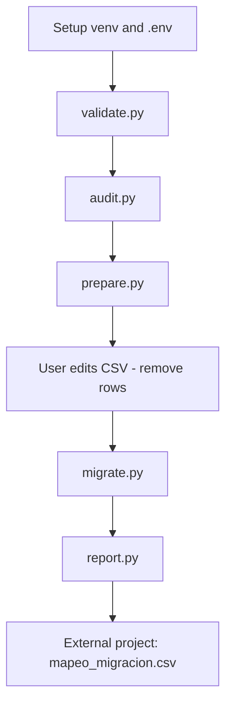
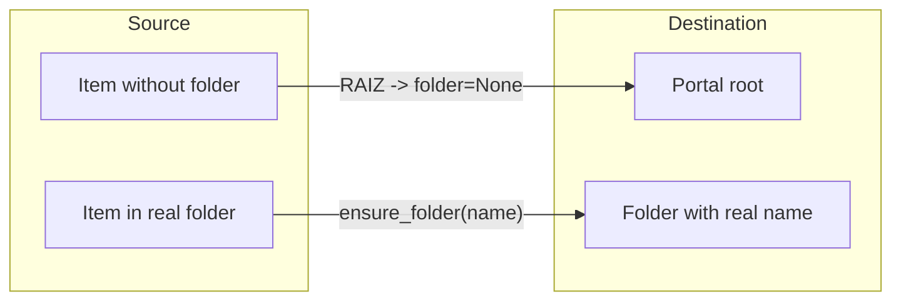

# ArcGIS Migration Workflow

Reference guide for the full workflow to clone Feature Services between ArcGIS portals.

---

## Flow diagram



---

## Workflow phases

| Phase | Command | Input | Output | Source | Destination | NEXT |
|-------|---------|-------|--------|--------|-------------|------|
| 1 Validate | `python scripts/validate.py` | `.env` | log | login | login | `audit.py` |
| 2 Audit | `python scripts/audit.py` | source portal | `inventario_con_carpetas.csv` | read | — | `prepare.py` |
| 3 Prepare | `python scripts/prepare.py` | audited inventory | `inventario_migracion.csv` | — | — | edit CSV |
| 4 Curate | manual | input CSV | edited CSV | — | — | `migrate.py` |
| 5 Migrate | `python scripts/migrate.py` | curated CSV | `mapeo_migracion.csv`, `state.db` | export temp + delete | upload FGDB + publish + delete FGDB | `report.py` |
| 6 Report | `python scripts/report.py` | `state.db` | `errores_migracion.csv` | — | — | external project |
| 7 External | other project | `mapeo_migracion.csv` | UPDATE DB | — | — | — |

---

## Phase 1 — Validate connections

```bash
python scripts/validate.py
```

- Checks `.env` variables and login to source and destination.
- **Does not export, upload, or publish layers.**

---

## Phase 2 — Audit

```bash
python scripts/audit.py
```

Generates `data/output/inventario_con_carpetas.csv` with columns:

- `Titulo`, `ID_Viejo`, `URL_Vieja`, `Carpeta_Origen`, `Tamaño_MB`

Read-only access to the source portal. Does not modify items.

---

## Phase 3 — Prepare inventory

```bash
python scripts/prepare.py
```

Automatically copies the audited inventory to `data/input/inventario_migracion.csv` with the columns `migrate.py` requires:

- `Titulo`, `ID_Viejo`, `URL_Vieja`, `Carpeta_Origen`

If the file already exists, aborts (use `--force` to overwrite).

---

## Phase 4 — Curate inventory (manual)

1. Open `data/input/inventario_migracion.csv`
2. **Remove rows** for layers you do not want to migrate
3. Save the file

Reference template: `data/input/inventario_migracion.example.csv`

---

## Phase 5 — Batch migration

```bash
python scripts/migrate.py
```

For each item in the curated inventory:

1. Gets the Feature Service from source
2. Enables Extract capability
3. Exports to File Geodatabase on source (`tmp_mig_*`)
4. Downloads ZIP to local `temp/`
5. Uploads FGDB to destination portal (in the corresponding folder)
6. Publishes Feature Service on destination
7. Deletes temporary FGDB on destination
8. Deletes temporary export on source and local ZIP

Persistent state in `state/migration_state.db`. Mapping in `data/output/mapeo_migracion.csv`.

### Resume / retry

```bash
python scripts/migrate.py              # skips success items
python scripts/migrate.py --retry-errors  # retries error items
```

| SQLite state | Behavior |
|--------------|----------|
| `success` | Skipped |
| `pending` / `in_progress` | Processed |
| `error` | Skipped (unless `--retry-errors`) |

---

## Phase 6 — Report

```bash
python scripts/report.py
```

Summary of total/success/errors/pending. Exports `data/output/errores_migracion.csv`.

---

## Phase 7 — External project (database)

This tool **does not update databases**. The deliverable is `data/output/mapeo_migracion.csv`.

### Columns

| Column | Use |
|--------|-----|
| `ID_Viejo` | Source ArcGIS ID (key for UPDATE) |
| `URL_Vieja` | Source REST URL |
| `ID_Nuevo` | Destination ArcGIS ID |
| `URL_Nueva` | Destination REST URL |
| `Titulo` | Human-readable name |
| `Carpeta_Origen` | Source folder (informational) |
| `Estado` | Filter only `EXITO` |
| `Error` | Detail if failed |
| `Fecha` | Migration timestamp |

### Rule

Filter `Estado == EXITO` before applying changes to the database.

### Example

```csv
ID_Viejo,URL_Vieja,ID_Nuevo,URL_Nueva,Titulo,Carpeta_Origen,Estado,Error,Fecha
daf865312ea445b98dca8f1e763990a9,https://services8.arcgis.com/.../FeatureServer,9ffa9ced3fdc46248a4f3700ae8cc685,https://services7.arcgis.com/.../FeatureServer,12354,RAIZ,EXITO,,2026-08-12 19:45:55
```

### External consumption pseudocode

```python
import pandas as pd

df = pd.read_csv("data/output/mapeo_migracion.csv")
ok = df[df["Estado"] == "EXITO"]
for _, row in ok.iterrows():
    # UPDATE layers SET arcgis_id = row.ID_Nuevo, url = row.URL_Nueva
    # WHERE arcgis_id = row.ID_Viejo
    pass
```

---

## RAIZ folder

`RAIZ` is an **internal label** for items that sit at the root of the source portal (no assigned folder).

A folder named "RAIZ" is **not created** on the destination portal.

Code behavior:

- `ensure_folder()`: if `folder_name` is `RAIZ` or empty, no folder is created
- `migrate_item()`: uses `folder=None` in the API → the Feature Service lands at the **destination portal root**

If `Carpeta_Origen` has a real name (e.g. `"Carmel FD - stage"`), that folder is created on destination only if it does not exist, and the item is published there.



---

## Generated files (runtime)

These files are created when running the workflow and **are not part of the source code**:

| File | Generated by |
|------|--------------|
| `data/output/inventario_con_carpetas.csv` | `audit.py` |
| `data/input/inventario_migracion.csv` | `prepare.py` + manual edit |
| `data/output/mapeo_migracion.csv` | `migrate.py` |
| `data/output/errores_migracion.csv` | `report.py` |
| `state/migration_state.db` | `migrate.py` |
| `logs/<script>_*.log` | all scripts |
| `temp/*.zip` | `migrate.py` (temporary) |

These files are excluded from source control.
