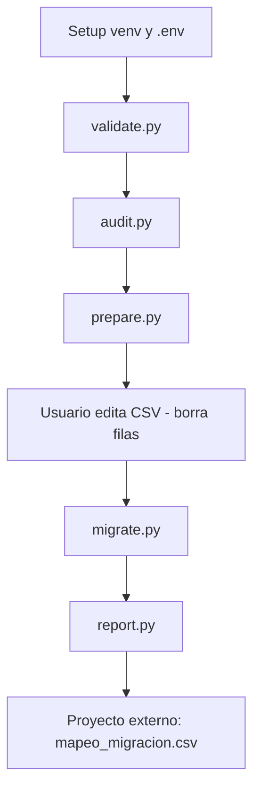
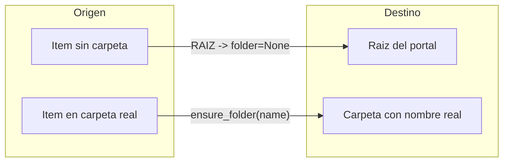

# Workflow de migracion ArcGIS

Guia de referencia del flujo completo para clonar Feature Services entre portales ArcGIS.

---

## Diagrama de flujo



---

## Fases del workflow

| Fase | Comando | Input | Output | Origen | Destino | NEXT |
|------|---------|-------|--------|--------|---------|------|
| 1 Validar | `python scripts/validate.py` | `.env` | log | login | login | `audit.py` |
| 2 Auditar | `python scripts/audit.py` | portal origen | `inventario_con_carpetas.csv` | lectura | — | `prepare.py` |
| 3 Preparar | `python scripts/prepare.py` | inventario auditado | `inventario_migracion.csv` | — | — | editar CSV |
| 4 Curar | manual | CSV input | CSV editado | — | — | `migrate.py` |
| 5 Migrar | `python scripts/migrate.py` | CSV curado | `mapeo_migracion.csv`, `state.db` | export temp + delete | upload FGDB + publish + delete FGDB | `report.py` |
| 6 Reportar | `python scripts/report.py` | `state.db` | `errores_migracion.csv` | — | — | proyecto externo |
| 7 Externo | otro proyecto | `mapeo_migracion.csv` | UPDATE BD | — | — | — |

---

## Fase 1 — Validar conexiones

```bash
python scripts/validate.py
```

- Comprueba variables `.env` y login en origen y destino.
- **No exporta, sube ni publica capas.**

---

## Fase 2 — Auditoria

```bash
python scripts/audit.py
```

Genera `data/output/inventario_con_carpetas.csv` con columnas:

- `Titulo`, `ID_Viejo`, `URL_Vieja`, `Carpeta_Origen`, `Tamaño_MB`

Solo lectura del portal origen. No modifica items.

---

## Fase 3 — Preparar inventario

```bash
python scripts/prepare.py
```

Copia automaticamente el inventario auditado a `data/input/inventario_migracion.csv` con las columnas que `migrate.py` necesita:

- `Titulo`, `ID_Viejo`, `URL_Vieja`, `Carpeta_Origen`

Si el archivo ya existe, aborta (use `--force` para sobrescribir).

---

## Fase 4 — Curar inventario (manual)

1. Abrir `data/input/inventario_migracion.csv`
2. **Eliminar filas** de capas que no desee migrar
3. Guardar el archivo

Plantilla de referencia: `data/input/inventario_migracion.example.csv`

---

## Fase 5 — Migracion masiva

```bash
python scripts/migrate.py
```

Por cada item del inventario curado:

1. Obtiene el Feature Service en origen
2. Habilita capacidad Extract
3. Exporta a File Geodatabase en origen (`tmp_mig_*`)
4. Descarga ZIP a `temp/` local
5. Sube FGDB al portal destino (en carpeta correspondiente)
6. Publica Feature Service en destino
7. Elimina FGDB temporal en destino
8. Elimina export temporal en origen y ZIP local

Estado persistente en `state/migration_state.db`. Mapeo en `data/output/mapeo_migracion.csv`.

### Reanudar / reintentar

```bash
python scripts/migrate.py              # salta items success
python scripts/migrate.py --retry-errors  # reintenta items en error
```

| Estado SQLite | Comportamiento |
|---------------|----------------|
| `success` | Se salta |
| `pending` / `in_progress` | Se procesa |
| `error` | Se salta (salvo `--retry-errors`) |

---

## Fase 6 — Reporte

```bash
python scripts/report.py
```

Resumen total/exitos/errores/pendientes. Exporta `data/output/errores_migracion.csv`.

---

## Fase 7 — Proyecto externo (BD)

Este tool **no actualiza bases de datos**. El entregable es `data/output/mapeo_migracion.csv`.

### Columnas

| Columna | Uso |
|---------|-----|
| `ID_Viejo` | ID ArcGIS origen (clave para UPDATE) |
| `URL_Vieja` | URL REST origen |
| `ID_Nuevo` | ID ArcGIS destino |
| `URL_Nueva` | URL REST destino |
| `Titulo` | Nombre legible |
| `Carpeta_Origen` | Carpeta origen (informativo) |
| `Estado` | Filtrar solo `EXITO` |
| `Error` | Detalle si fallo |
| `Fecha` | Timestamp de migracion |

### Regla

Filtrar `Estado == EXITO` antes de aplicar cambios en BD.

### Ejemplo

```csv
ID_Viejo,URL_Vieja,ID_Nuevo,URL_Nueva,Titulo,Carpeta_Origen,Estado,Error,Fecha
daf865312ea445b98dca8f1e763990a9,https://services8.arcgis.com/.../FeatureServer,9ffa9ced3fdc46248a4f3700ae8cc685,https://services7.arcgis.com/.../FeatureServer,12354,RAIZ,EXITO,,2026-08-12 19:45:55
```

### Pseudocodigo consumo externo

```python
import pandas as pd

df = pd.read_csv("data/output/mapeo_migracion.csv")
ok = df[df["Estado"] == "EXITO"]
for _, row in ok.iterrows():
    # UPDATE capas SET arcgis_id = row.ID_Nuevo, url = row.URL_Nueva
    # WHERE arcgis_id = row.ID_Viejo
    pass
```

---

## Carpeta RAIZ

`RAIZ` es una **etiqueta interna** para items que en origen estan en la raiz del portal (sin carpeta asignada).

**No se crea** una carpeta llamada "RAIZ" en el portal destino.

Comportamiento en codigo:

- `ensure_folder()`: si `folder_name` es `RAIZ` o vacio, no crea carpeta
- `migrate_item()`: usa `folder=None` en la API → el Feature Service queda en la **raiz del portal destino**

Si `Carpeta_Origen` tiene un nombre real (ej. `"Carmel FD - stage"`), se crea esa carpeta en destino solo si no existe, y el item se publica ahi.



---

## Archivos generados (runtime)

Estos archivos se crean al ejecutar el workflow y **no forman parte del codigo fuente**:

| Archivo | Generado por |
|---------|--------------|
| `data/output/inventario_con_carpetas.csv` | `audit.py` |
| `data/input/inventario_migracion.csv` | `prepare.py` + edicion manual |
| `data/output/mapeo_migracion.csv` | `migrate.py` |
| `data/output/errores_migracion.csv` | `report.py` |
| `state/migration_state.db` | `migrate.py` |
| `logs/<script>_*.log` | todos los scripts |
| `temp/*.zip` | `migrate.py` (temporal) |

Ver `.gitignore` para la lista completa de exclusiones.
