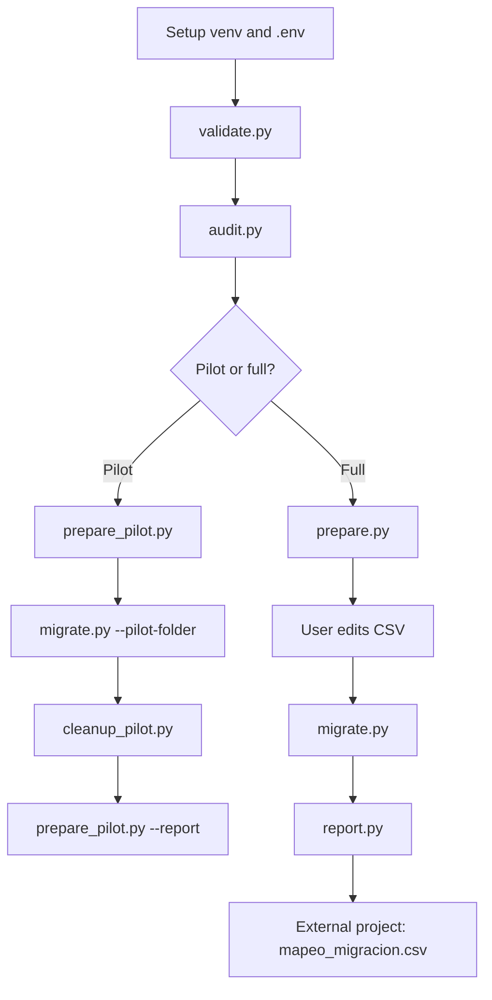
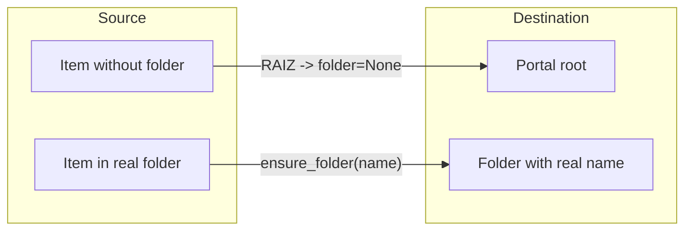

# ArcGIS Migration Workflow

Reference guide for the full workflow to clone portal content between ArcGIS portals (multi-type with drivers).

---

## Flow diagram



---

## Workflow phases (production)

| Phase | Command | Input | Output | NEXT |
|-------|---------|-------|--------|------|
| 1 Validate | `python scripts/validate.py` | `.env` | log | `audit.py` |
| 2 Audit | `python scripts/audit.py` | source portal | `inventario_con_carpetas.csv` | `prepare_pilot.py` or `prepare.py` |
| 3 Prepare | `python scripts/prepare.py` | audited inventory | `inventario_migracion.csv` | edit CSV |
| 4 Curate | manual | input CSV | edited CSV | `migrate.py` |
| 5 Migrate | `python scripts/migrate.py` | curated CSV | `mapeo_migracion.csv`, `state.db` | `report.py` |
| 6 Report | `python scripts/report.py` | `state.db` | `errores_migracion.csv` | external project |

---

## Pilot workflow (1 item per ArcGIS Type)

Use this **before** full migration to test all ~44 content types without polluting the destination portal.

| Phase | Command |
|-------|---------|
| A Validate | `python scripts/validate.py` |
| B Audit | `python scripts/audit.py` |
| C Prepare pilot | `python scripts/prepare_pilot.py --force` |
| D Migrate pilot | `python scripts/migrate.py --inventory data/input/inventario_pilot.csv --pilot-folder MIGRACION_PILOTO_TIPOS` |
| E Cleanup | `python scripts/cleanup_pilot.py --inventory data/input/inventario_pilot.csv --pilot-folder MIGRACION_PILOTO_TIPOS` |
| F Matrix | `python scripts/prepare_pilot.py --report` |

Pilot uses isolated state: `state/pilot_state.db` and `data/output/mapeo_pilot.csv`.

Expected pilot inventory: **~44 rows** (one per ArcGIS `Type`, not one per internal driver).

| Result in mapeo | Meaning |
|-----------------|---------|
| `EXITO` | Type migrated successfully |
| `SKIP` | Type excluded by design (API Key, Hub, etc.) |
| `ERROR` | Migration attempted and failed |

Dry-run cleanup:

```bash
python scripts/cleanup_pilot.py --dry-run
```

---

## Migration drivers

Items are routed by ArcGIS `Type` to one of three internal drivers:

| Driver | Types | Mechanism |
|--------|-------|-----------|
| `feature_service` | Feature Service | export FGDB → upload → publish (proven flow) |
| `clone_items` | Most other types | `clone_items(copy_data=True)` |
| `skip` | API Key, Hub, Admin Report, etc. | Registered as SKIP, no API call |

Execution order: **Fase 1** (data/services) → **Fase 2** (Web Maps, Dashboards…) → **Fase 0** (skip types).

---

## Phase 1 — Validate connections

```bash
python scripts/validate.py
```

- Checks `.env` variables and login to source and destination.
- **Does not export, upload, or publish layers.**

---

## Phase 2 — Audit

```bash
python scripts/audit.py
```

Generates `data/output/inventario_con_carpetas.csv` with columns:

- `Titulo`, `ID_Viejo`, `URL_Vieja`, `Carpeta_Origen`, `Tamaño_MB`, `Type`, `Fase`, `Driver`

Read-only access to the source portal. Inventories **all org content** (~2971 items, ~45 types).

---

## Phase 3 — Prepare inventory

```bash
python scripts/prepare.py
```

Automatically copies the audited inventory to `data/input/inventario_migracion.csv` with columns:

- `Titulo`, `ID_Viejo`, `URL_Vieja`, `Carpeta_Origen`, `Type`, `Fase`, `Driver`

If the file already exists, aborts (use `--force` to overwrite).

---

## Phase 4 — Curate inventory (manual)

1. Open `data/input/inventario_migracion.csv`
2. **Remove rows** for layers you do not want to migrate
3. Save the file

Reference template: `data/input/inventario_migracion.example.csv`

---

## Phase 5 — Batch migration

```bash
python scripts/migrate.py
python scripts/migrate.py --inventory data/input/inventario_pilot.csv --pilot-folder MIGRACION_PILOTO_TIPOS
```

For each item, the router selects a driver by `Type`:

1. **Feature Service** — export FGDB → upload → publish (unchanged)
2. **Other types** — `clone_items(copy_data=True)`
3. **Skip types** — registered as SKIP in mapeo

Persistent state in `state/migration_state.db` (or `state/pilot_state.db` for pilot).
Mapping in `data/output/mapeo_migracion.csv` (or `mapeo_pilot.csv` for pilot).

### Resume / retry

```bash
python scripts/migrate.py              # skips success items
python scripts/migrate.py --retry-errors  # retries error items
```

| SQLite state | Behavior |
|--------------|----------|
| `success` | Skipped |
| `skipped` | Skipped (SKIP types or intentional skip) |
| `pending` / `in_progress` | Processed |
| `error` | Skipped (unless `--retry-errors`) |

---

## Phase 6 — Report

```bash
python scripts/report.py
```

Summary of total/success/errors/skipped/pending. Exports `data/output/errores_migracion.csv` (ERROR only, not SKIP).

---

## Phase 7 — External project (database)

This tool **does not update databases**. The deliverable is `data/output/mapeo_migracion.csv`.

### Columns

| Column | Use |
|--------|-----|
| `ID_Viejo` | Source ArcGIS ID (key for UPDATE) |
| `URL_Vieja` | Source REST URL |
| `ID_Nuevo` | Destination ArcGIS ID |
| `URL_Nueva` | Destination REST URL |
| `Titulo` | Human-readable name |
| `Carpeta_Origen` | Source folder (informational) |
| `Estado` | Filter only `EXITO` |
| `Error` | Detail if failed |
| `Fecha` | Migration timestamp |

### Rule

Filter `Estado == EXITO` before applying changes to the database.

### Example

```csv
ID_Viejo,URL_Vieja,ID_Nuevo,URL_Nueva,Titulo,Carpeta_Origen,Estado,Error,Fecha
daf865312ea445b98dca8f1e763990a9,https://services8.arcgis.com/.../FeatureServer,9ffa9ced3fdc46248a4f3700ae8cc685,https://services7.arcgis.com/.../FeatureServer,12354,RAIZ,EXITO,,2026-08-12 19:45:55
```

### External consumption pseudocode

```python
import pandas as pd

df = pd.read_csv("data/output/mapeo_migracion.csv")
ok = df[df["Estado"] == "EXITO"]
for _, row in ok.iterrows():
    # UPDATE layers SET arcgis_id = row.ID_Nuevo, url = row.URL_Nueva
    # WHERE arcgis_id = row.ID_Viejo
    pass
```

---

## RAIZ folder

`RAIZ` is an **internal label** for items that sit at the root of the source portal (no assigned folder).

A folder named "RAIZ" is **not created** on the destination portal.

Code behavior:

- `ensure_folder()`: if `folder_name` is `RAIZ` or empty, no folder is created
- `migrate_item()`: uses `folder=None` in the API → the Feature Service lands at the **destination portal root**

If `Carpeta_Origen` has a real name (e.g. `"Carmel FD - stage"`), that folder is created on destination only if it does not exist, and the item is published there.



---

## Generated files (runtime)

These files are created when running the workflow and **are not part of the source code**:

| File | Generated by |
|------|--------------|
| `data/output/inventario_con_carpetas.csv` | `audit.py` |
| `data/input/inventario_migracion.csv` | `prepare.py` + manual edit |
| `data/input/inventario_pilot.csv` | `prepare_pilot.py` (runtime, gitignored) |
| `data/input/inventario_pilot.example.csv` | template (committed) |
| `data/output/mapeo_migracion.csv` | `migrate.py` |
| `data/output/mapeo_pilot.csv` | `migrate.py` (pilot mode) |
| `data/output/pilot_matrix.csv` | `prepare_pilot.py --report` |
| `data/output/errores_migracion.csv` | `report.py` |
| `state/migration_state.db` | `migrate.py` |
| `state/pilot_state.db` | `migrate.py` (pilot mode) |
| `logs/<script>_*.log` | all scripts |
| `temp/*.zip` | `migrate.py` (temporary) |

These files are excluded from source control.
