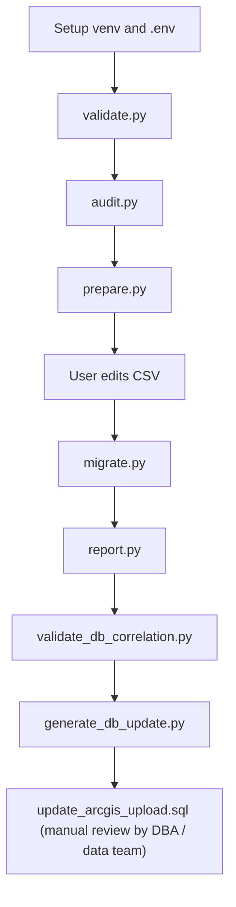
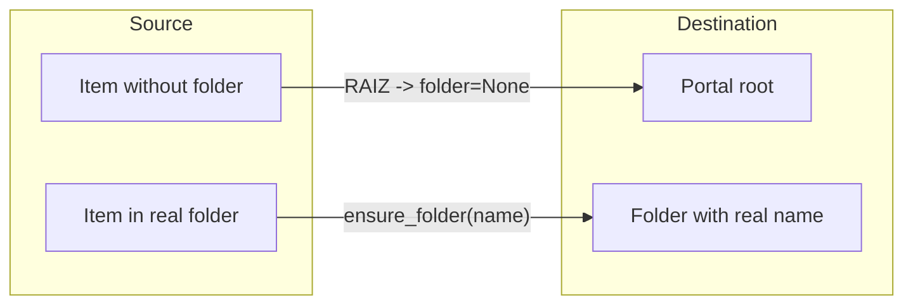

# ArcGIS Migration Workflow

Reference guide for migrating hosted content between ArcGIS portals. The **default path is production** (full inventory → migrate → mapeo CSV for DB updates).

> Looking for copy-paste, step-by-step execution instructions (install → cleanup → migrate → DB update)? See [GUIA_EJECUCION.md](GUIA_EJECUCION.md). This document is the technical reference behind those steps.

---

## Flow diagram (production)


```mermaid
flowchart TD
  Setup[Setup venv and .env] --> Validate[validate.py]
  Validate --> Audit[audit.py]
  Audit --> Prepare[prepare.py]
  Prepare --> Curate[User edits CSV]
  Curate --> Migrate[migrate.py]
  Migrate --> Report[report.py]
  Report --> ValidateDb[validate_db_correlation.py]
  ValidateDb --> GenerateSql[generate_db_update.py]
  GenerateSql --> External["update_arcgis_upload.sql (manual review by DBA / data team)"]
```

---

## Workflow phases (production)

| Phase | Command | Input | Output | NEXT |
|-------|---------|-------|--------|------|
| 1 Validate | `python scripts/validate.py` | `.env` | log | `audit.py` |
| 2 Audit | `python scripts/audit.py` | source portal | `inventario_con_carpetas.csv` | `prepare.py` |
| 3 Prepare | `python scripts/prepare.py` (or `--db-dsn`/`--arcgis-upload-csv` to filter by `app.arcgis_upload`) | audited inventory | `inventario_migracion.csv` | edit CSV (skip if filtered) |
| 4 Curate | manual | input CSV | edited CSV | `migrate.py` |
| 5 Migrate | `python scripts/migrate.py` | curated CSV | `mapeo_migracion.csv`, `state.db` | `report.py` |
| 6 Report | `python scripts/report.py` | `state.db` | `errores_migracion.csv` | external project |
| 7a Validate DB correlation | `python scripts/validate_db_correlation.py --db-dsn` | `app.arcgis_upload` + source portal | `validacion_correlacion.csv` | `generate_db_update.py` |
| 7b Generate DB update | `python scripts/generate_db_update.py --db-dsn` | `mapeo_migracion.csv` + `app.arcgis_upload` | `update_arcgis_upload.sql` | DBA runs the SQL manually |

---

## Why IDs and URLs change (read this first)

A **real migration** (independent hosted data on the destination portal) **always** creates new item IDs and new Feature Service REST URLs. There is no ArcGIS Online setting that keeps the same `servicesN.arcgis.com/.../FeatureServer` URL when publishing into another org.

| Method | What it does | URL / ID |
|--------|--------------|----------|
| This toolkit (`FeatureServiceDriver`) | export FGDB → upload → publish | **New** ID and URL |
| `clone_items(copy_data=True)` | Recreate hosted layer on destination | New ID / URL |
| ArcGIS Assistant **simple / reference copy** | New portal item that **points at the source service** | **Same URL** (data still on source — not a cutover) |
| ArcGIS Assistant **full copy** | Independent replica on destination | New ID / URL |

**Implication:** if Assistant kept the same URL when you dragged one service, that was almost certainly a **reference copy**, not ownership of the data on the new portal. For cutover to Location Platform / a new org, you still need `data/output/mapeo_migracion.csv` to update application databases with the new IDs and URLs.

`preserve_item_id` / `item_id=` apply only to **Enterprise → Enterprise**, not AGOL destinations — and even then the hosted service URL still changes on republish.

See also: [URL_PRESERVATION.md](URL_PRESERVATION.md).

---

## Migration drivers

Items are routed by ArcGIS `Type` to one of three internal drivers:

| Driver | Types | Mechanism |
|--------|-------|-----------|
| `feature_service` | Feature Service | export FGDB → upload → publish (proven flow) |
| `clone_items` | Most other types | `clone_items(copy_data=True)` |
| `skip` | API Key, Hub, Admin Report, etc. | Registered as SKIP, no API call |

Execution order: **Fase 1** (data/services) → **Fase 2** (Web Maps, Dashboards…) → **Fase 0** (skip types).

---

## Phase 1 — Validate connections

```bash
python scripts/validate.py
```

- Checks `.env` variables and login to source and destination.
- **Does not export, upload, or publish layers.**

---

## Phase 2 — Audit

```bash
python scripts/audit.py
```

Generates `data/output/inventario_con_carpetas.csv` with columns:

- `Titulo`, `ID_Viejo`, `URL_Vieja`, `Carpeta_Origen`, `Tamaño_MB`, `Type`, `Fase`, `Driver`

Read-only access to the source portal. Inventories **all org content**.

---

## Phase 3 — Prepare inventory

```bash
python scripts/prepare.py
```

Automatically copies the audited inventory to `data/input/inventario_migracion.csv` with columns:

- `Titulo`, `ID_Viejo`, `URL_Vieja`, `Carpeta_Origen`, `Type`, `Fase`, `Driver`

If the file already exists, aborts (use `--force` to overwrite).

### Optional: filter automatically using `app.arcgis_upload`

```bash
python scripts/prepare.py --db-dsn
# or: python scripts/prepare.py --arcgis-upload-csv path/to/export.csv
```

Instead of copying the full audited inventory, keeps only the rows whose
`ID_Viejo`/`URL_Vieja` match a `layer_id`/`service_url` in `app.arcgis_upload`
(default join key: `layer_id`; `--join-key service_url` is available).
Rows present in `arcgis_upload` but missing from the audit (e.g. private
items not visible to the auditing account) are resolved with a direct
`content.get(layer_id)` lookup against the source portal before being
reported as unresolved in `data/output/sin_match_inventario_db.csv`.
Reuses the same `db_client.py` (and `--only-system-account`) as
`validate_db_correlation.py`/`generate_db_update.py` — see
[DB_CORRELATION.md](DB_CORRELATION.md).

---

## Phase 4 — Curate inventory (manual)

1. Open `data/input/inventario_migracion.csv`
2. **Remove rows** for layers you do not want to migrate
3. Save the file

Reference template: `data/input/inventario_migracion.example.csv`

For a Feature-Service-only cutover, keep rows where `Type` is `Feature Service` (and any related types you explicitly need).

---

## Phase 5 — Batch migration

```bash
python scripts/migrate.py
```

For each item, the router selects a driver by `Type`:

1. **Feature Service** — export FGDB → upload → publish
2. **Other types** — `clone_items(copy_data=True)`
3. **Skip types** — registered as SKIP in mapeo

Persistent state: `state/migration_state.db`  
Mapping: `data/output/mapeo_migracion.csv`

### Resume / retry

```bash
python scripts/migrate.py              # skips success items
python scripts/migrate.py --retry-errors  # retries error items
```

| SQLite state | Behavior |
|--------------|----------|
| `success` | Skipped |
| `skipped` | Skipped (SKIP types or intentional skip) |
| `pending` / `in_progress` | Processed |
| `error` | Skipped (unless `--retry-errors`) |

---

## Phase 6 — Report

```bash
python scripts/report.py
```

Summary of total/success/errors/skipped/pending. Exports `data/output/errores_migracion.csv` (ERROR only, not SKIP).

---

## Phase 7 — External project (database)

This tool **does not update databases**. The deliverable is `data/output/mapeo_migracion.csv`.

### Columns

| Column | Use |
|--------|-----|
| `ID_Viejo` | Source ArcGIS ID (key for UPDATE) |
| `URL_Vieja` | Source REST URL |
| `ID_Nuevo` | Destination ArcGIS ID |
| `URL_Nueva` | Destination REST URL |
| `Titulo` | Human-readable name |
| `Carpeta_Origen` | Source folder (informational) |
| `Estado` | Filter only `EXITO` |
| `Error` | Detail if failed |
| `Fecha` | Migration timestamp |

### Rule

Filter `Estado == EXITO` before applying changes to the database.

### Example

```csv
ID_Viejo,URL_Vieja,ID_Nuevo,URL_Nueva,Titulo,Carpeta_Origen,Estado,Error,Fecha
daf865312ea445b98dca8f1e763990a9,https://services8.arcgis.com/.../FeatureServer,9ffa9ced3fdc46248a4f3700ae8cc685,https://services7.arcgis.com/.../FeatureServer,12354,RAIZ,EXITO,,2026-08-12 19:45:55
```

### External consumption pseudocode

```python
import pandas as pd

df = pd.read_csv("data/output/mapeo_migracion.csv")
ok = df[df["Estado"] == "EXITO"]
for _, row in ok.iterrows():
    # UPDATE layers SET arcgis_id = row.ID_Nuevo, url = row.URL_Nueva
    # WHERE arcgis_id = row.ID_Viejo
    pass
```

---

## Phase 7a — Validate DB correlation (optional helper)

```bash
python scripts/validate_db_correlation.py --db-dsn
# or: python scripts/validate_db_correlation.py --arcgis-upload-csv path/to/export.csv
```

Read-only. Confirms, against the **source** portal, whether `app.arcgis_upload.layer_id` is the source item's `itemId` and `service_url` is its `url` — the correlation key assumed by Phase 7b. See [DB_CORRELATION.md](DB_CORRELATION.md).

Requires optional `.env` vars: `PGDSN` (full Postgres DSN, URI or keyword/value), `PGSCHEMA` (not part of the core migration flow).

---

## Phase 7b — Generate DB update SQL (optional helper)

```bash
python scripts/generate_db_update.py --db-dsn
# or: python scripts/generate_db_update.py --arcgis-upload-csv path/to/export.csv
```

Joins `mapeo_migracion.csv` (`Estado == EXITO`) against `app.arcgis_upload` (default join key: `layer_id == ID_Viejo`; `--join-key service_url` is available as an alternative) and writes `data/output/update_arcgis_upload.sql` with one `UPDATE app.arcgis_upload SET service_url = ..., layer_id = ... WHERE id = ...` per match, wrapped in `BEGIN;`/`COMMIT;`.

By default (unless `--no-token`), it also requests one fresh ArcGIS token for `DESTINO_USER`/`DESTINO_PASS` (via REST `generateToken` against `DESTINO_URL`, not the stale **source**-portal token already stored in `access_token`) and adds `username`, `access_token`, `token_expires_at` to each `UPDATE`. Default expiration: 60 minutes, configurable via `TOKEN_EXPIRATION_MINUTES` in `.env` or `--token-expiration-minutes`. The resulting `.sql` therefore holds a live credential while the token is valid — handle it as a secret and apply it before expiration.

This script **never executes SQL against the database** — it only reads (to match) and writes the `.sql` file; requesting the token is a read-only auth call against ArcGIS's REST API, not a write to either portal. The data team/DBA reviews and runs the `.sql` manually, consistent with the rest of this toolkit ("this tool does not update databases").

Unmatched `EXITO` rows are reported in `data/output/sin_match_arcgis_upload.csv` so nothing is silently dropped.

---

## RAIZ folder

`RAIZ` is an **internal label** for items that sit at the root of the source portal (no assigned folder).

A folder named "RAIZ" is **not created** on the destination portal.

Code behavior:

- `ensure_folder()`: if `folder_name` is `RAIZ` or empty, no folder is created
- `migrate_item()`: uses `folder=None` in the API → the Feature Service lands at the **destination portal root**

If `Carpeta_Origen` has a real name (e.g. `"Carmel FD - stage"`), that folder is created on destination only if it does not exist, and the item is published there.


```mermaid
flowchart LR
  subgraph source [Source]
    RootItem[Item without folder]
    FolderItem[Item in real folder]
  end
  subgraph destination [Destination]
    PortalRoot[Portal root]
    RealFolder[Folder with real name]
  end
  RootItem -->|"RAIZ -> folder=None"| PortalRoot
  FolderItem -->|"ensure_folder(name)"| RealFolder
```

---

## Generated files (runtime)

These files are created when running the workflow and **are not part of the source code**:

| File | Generated by |
|------|--------------|
| `data/output/inventario_con_carpetas.csv` | `audit.py` |
| `data/input/inventario_migracion.csv` | `prepare.py` + manual edit |
| `data/output/mapeo_migracion.csv` | `migrate.py` |
| `data/output/errores_migracion.csv` | `report.py` |
| `data/output/sin_match_inventario_db.csv` | `prepare.py` (solo si usa `--db-dsn`/`--arcgis-upload-csv` y hay filas sin resolver) |
| `data/output/validacion_correlacion.csv` | `validate_db_correlation.py` |
| `data/output/update_arcgis_upload.sql` | `generate_db_update.py` |
| `data/output/sin_match_arcgis_upload.csv` | `generate_db_update.py` (solo si hay filas sin match) |
| `state/migration_state.db` | `migrate.py` |
| `logs/<script>_*.log` | all scripts |
| `temp/*.zip` | `migrate.py` (temporary) |

These files are excluded from source control.

---

## Isolated test runs and cleanup

### Isolated destination folder (optional)

```bash
python scripts/migrate.py --inventory <csv_de_prueba.csv> --pilot-folder <CARPETA_DESTINO>
```

Migrates a small, user-curated CSV into an isolated destination folder, with its own state (`state/pilot_state.db`) and mapping (`data/output/mapeo_pilot.csv`), without touching the main `migration_state.db` / `mapeo_migracion.csv`. Useful to try the drivers on a handful of items before a full production run.

### Cleanup destination (test items)

```bash
python scripts/cleanup_destino.py --folder <CARPETA_DESTINO>
python scripts/cleanup_destino.py --item-id <itemId> [--item-id <itemId> ...]
python scripts/cleanup_destino.py --folder <CARPETA_DESTINO> --dry-run
```

Deletes items in the **destination** portal by folder and/or by explicit `itemId`. It does not depend on any migration state, so it also works for items created outside this toolkit (e.g. manual test items). Always targets `DESTINO_*` from `.env` — never the source portal.

### Cleanup local generated files

```bash
python scripts/cleanup_local.py --dry-run
python scripts/cleanup_local.py --yes
```

Clears `logs/`, `data/output/*`, `state/*.db` and `temp/*` to start a test run from a clean slate. Only touches local files — never ArcGIS Online or any database.
